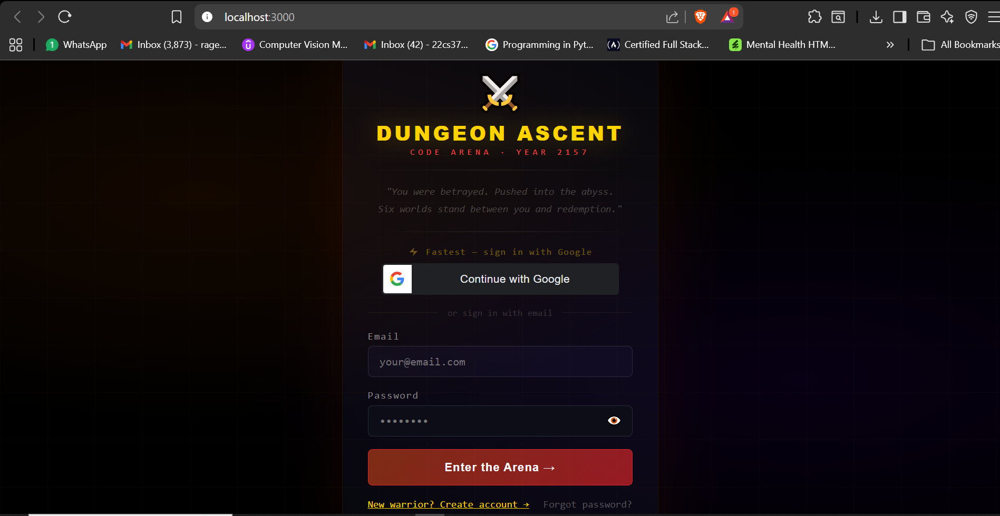
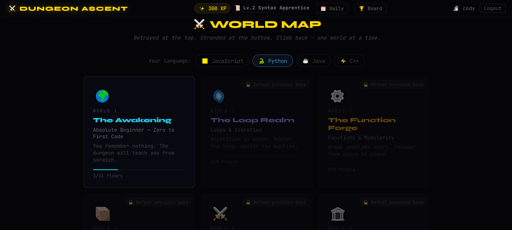
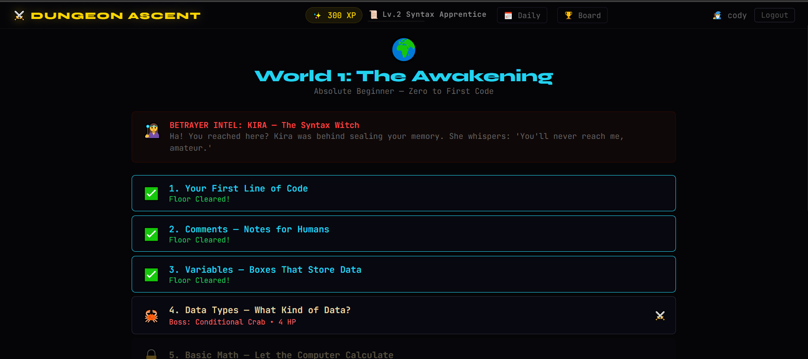
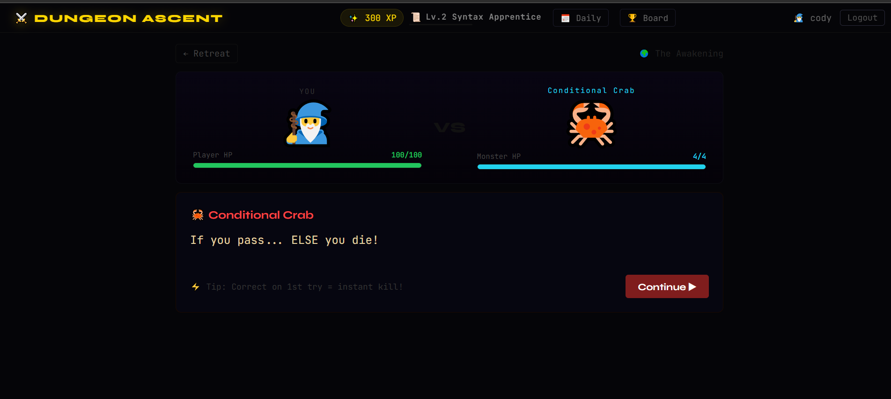
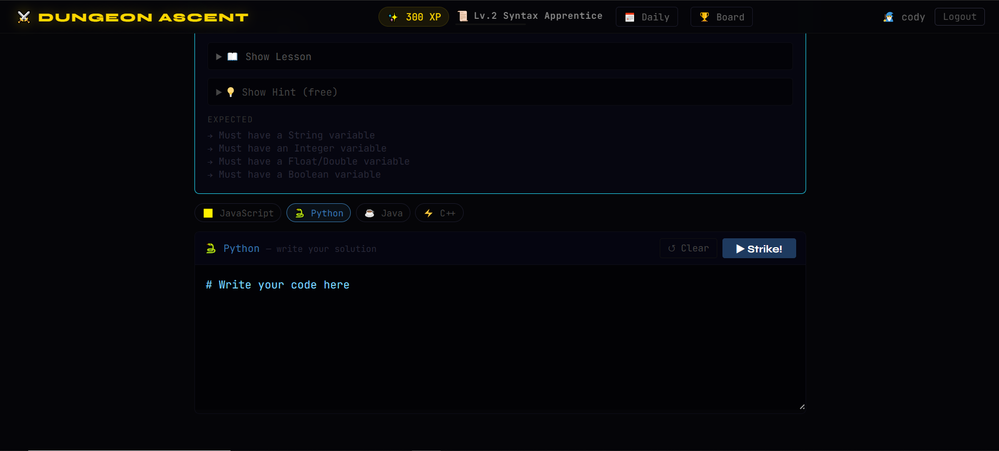

# ⚔️ Dungeon Ascent

> _Betrayed. Thrown into the Abyss. Armed with nothing but code._
>
> Dungeon Ascent is a full-stack MERN gamified coding platform where players fight monsters by solving programming challenges.
> Every correct solution weakens the enemy. Every floor conquered earns XP.
> Rise from the lowest abyss and reclaim your destiny.

---

## 🧩 Storyline

The hero was betrayed and pushed into the lowest floor of the Abyss.
With no sword, no armor — only coding skills remain.

To escape:

- Defeat monsters
- Clear floors
- Conquer worlds
- Climb the leaderboard
- Become the strongest coder

---

## 🎮 Core Features

### 🗺️ Multiple Worlds & Floors

- Each world contains multiple floors
- Each floor has a unique monster
- Monsters present coding challenges
- Clear a floor to unlock the next one

### 💀 Monster Battle System

- Solve coding problems to damage monsters
- XP gained after clearing floors
- Progressive difficulty scaling

### 🧠 Code Execution Engine

- Secure remote execution using **Piston API**
- Docker containerized setup for safe sandboxing

### 🏆 XP & Leaderboard

- XP system based on:
  - Floor completion
  - Boss fights
  - Daily challenges

- Global leaderboard ranking system

### 📅 Daily Challenges

- Special daily coding challenges
- Extra XP rewards
- Encourages consistent practice

### 🔐 Authentication System

- JWT-based authentication
- Google OAuth login integration
- Email verification with OTP system
- Secure password hashing

### 💾 Persistent Game Progress

- MongoDB stores:
  - User data
  - XP
  - World progress
  - Rankings

- Resume from any device

---

## 🛠 Tech Stack

### Frontend

- React.js
- Tailwind / Custom CSS
- Responsive UI

### Backend

- Node.js
- Express.js
- REST API Architecture

### Database

- MongoDB Atlas

### DevOps / Infrastructure

- Docker (Piston container handling)
- JWT Authentication
- OAuth 2.0 (Google Login)

---

## 🧱 Architecture Overview

Client (React)
⬇
Express API (Node.js)
⬇
MongoDB (User + Progress + Leaderboard)
⬇
Dockerized Piston API (Code Execution)

---

## 📦 Installation Guide

### 1️⃣ Clone Repository

```bash
git clone https://github.com/your-username/dungeon-ascent.git
cd dungeon-ascent
```

### 2️⃣ Install Dependencies

Backend:

```bash
cd server
npm install
```

Frontend:

```bash
cd client
npm install
```

### 3️⃣ Environment Variables

Create a `.env` file inside `server`:

```env
MONGO_URI=your_mongodb_uri
JWT_SECRET=your_secret_key
GOOGLE_CLIENT_ID=your_google_client_id
EMAIL_USER=your_email
EMAIL_PASS=your_email_password
```

### 4️⃣ Run Docker (Piston API)

```bash
docker-compose up -d
```

### 5️⃣ Start Development Servers

Backend:

```bash
npm run dev
```

Frontend:

```bash
npm start
```

---

## 📊 XP System Logic

- Floor Clear → XP Gain
- Boss Defeat → Bonus XP
- Daily Challenge → Extra XP
- Rankings update automatically

---

## 🚀 Future Enhancements

- Boss Raid Mode
- Multiplayer Battle Arena
- Inventory & Skill Tree System
- Seasonal Events
- Achievements & Badges
- PvP Code Duels

---

## 🤝 Contributing

Pull requests are welcome.
For major changes, please open an issue first to discuss what you'd like to change.

---

## 📜 License

MIT License

---

## 🌟 Final Note

Dungeon Ascent is more than a game.
It’s a battlefield for coders.

Sharpen your logic.
Defeat the abyss.
Rise.

<h2 align="center">🏰 Game Preview</h2>

<p align="center">
  
  
</p>

<p align="center">
  
  
</p>

<p align="center">
  
</p>
